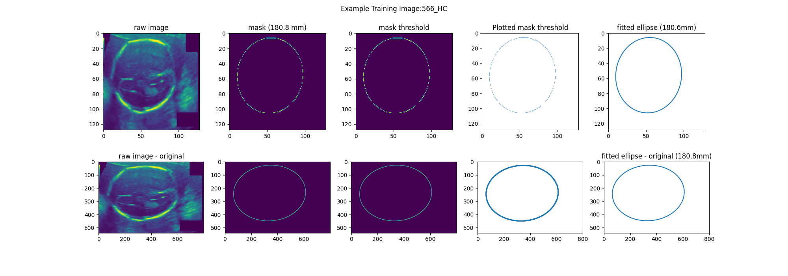
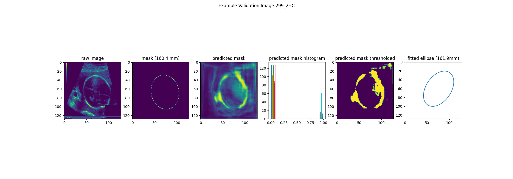
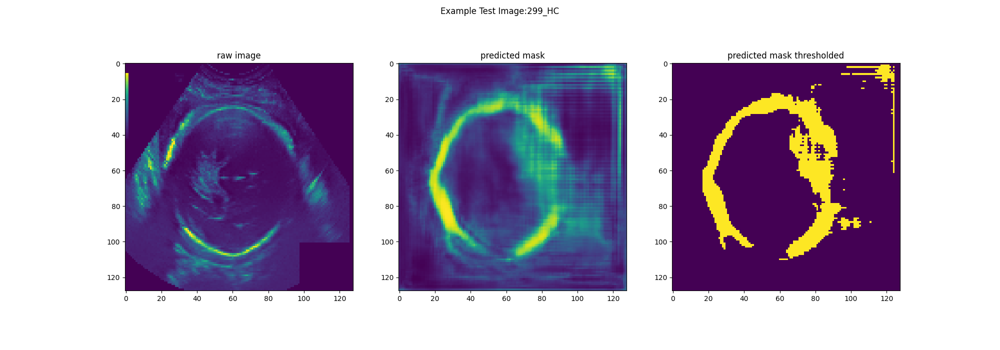

# head-circumference

## Description

This code presents a method to automatically estimate the head-circumference of a fetus from ultrasound images. It utilises a deep neural network with a [U-Net](https://en.wikipedia.org/wiki/U-Net) architecture. Importantly, there are no explicit shape constraints built-into the model, which is in contrast to the methods reviewed by [Bohlender and colleagues (2022)](https://arxiv.org/abs/2101.07721).

## Requirements

The data is from [zenodo](https://zenodo.org/record/1327317#.ZCqRwbxBzCk).
Download the data and change the value of data\_dir in [main.py (line 15)](hc\_estimation\_with\_unet.py) to the location of your local copy.

The code runs in python using [pytorch](https://pytorch.org). 
In addition to installing the necessary packages (see "import" commands in [hc\_estimation\_with\_unet.py](hc\_estimation\_with\_unet.py) and [ellipse.py](ellipse.py)), [early-stopping](https://github.com/Bjarten/early-stopping-pytorch) code needs to be added to the current folder.

## References
The data are provided by [van der Heuvel and colleagues (2018)](https://doi.org/10.1371/journal.pone.0200412) and were made available as part of a [grand challenge](http://hc18.grand-challenge.org). The U-Net architecture was developed by [Ronneberger and colleagues (2015)](https://arxiv.org/abs/1505.04597) and implemented in pytorch by [Pavel Iakubovski](https://github.com/qubvel/segmentation_models.pytorch). The model parameters were inspired by Maxim Kovito's code on [Nerve Segmentation with Ultrasound](https://www.kaggle.com/code/maximkovito/nerve-segmentation-unet). The fitting of the [ellipse](https://scipython.com/blog/direct-linear-least-squares-fitting-of-an-ellipse/) and the calculation of [circumference](https://scipython.com/book2/chapter-8-scipy/examples/the-circumference-of-an-ellipse/) use code adapted from [Christian Hill](https://scipython.com). A version of this code was submitted as a part of the final project for the Deep-Learning Course (Data Scientist Certificate) by [alfatraining](https://www.alfatraining.com). 

## Output Images
Example of training data:

Example of validation data:

Example of test data:

## Future work
Currently the fitting of the ellipse is based on a [least-squares method ](https://en.wikipedia.org/wiki/Least_squares), which is too senstitive to extra-cranial artefacts. To reduct this, future versions will use an [active geometry shape model](https://doi.org/10.1016/j.cviu.2012.08.004) based on [gradient vector flow ](https://www.iacl.ece.jhu.edu/static/gvf/). The code will be based on this [repository](https://github.com/wq2012/AGSM).
